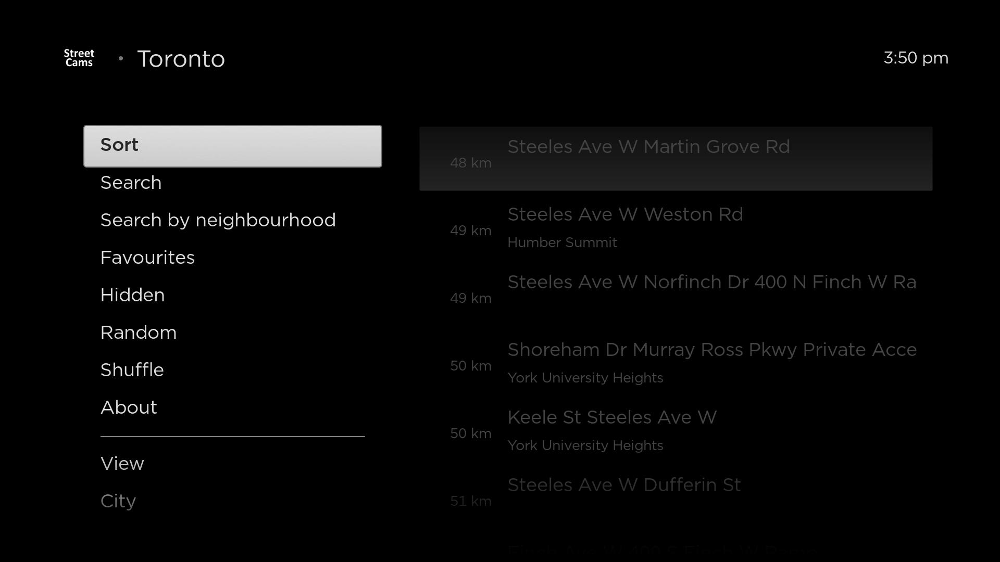

# StreetCamsRoku
StreetCams Roku TV App

This is an iteration of StreetCams created for Roku TV using brightscript. 
This app shows live images from cameras in various areas.

## Screenshots
<table>
<td>

</td>
</table>